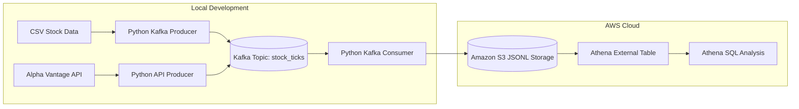
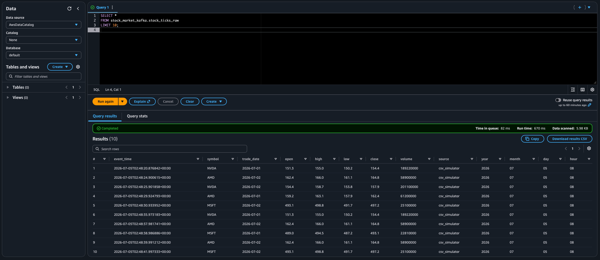

# Stock Market Real-Time Data Pipeline with Kafka and AWS

This project is a real-time stock market data pipeline built with Kafka, Python, Amazon S3, AWS Glue Data Catalog, and Amazon Athena.

This repository includes a working local Kafka setup, Python producer/consumer scripts, S3 batch uploads, an Alpha Vantage API producer, and Athena SQL queries for analyzing streamed stock events.

The pipeline can stream either simulated stock market events from a CSV file or quote data from an external stock market API. Events are sent through Kafka, stored as partitioned JSONL files in Amazon S3, and queried using Athena SQL.

## Architecture



## Tech Stack

- Python
- Apache Kafka
- Docker / Docker Compose
- Amazon S3
- AWS Glue Data Catalog
- Amazon Athena
- SQL
- boto3
- confluent-kafka
- pandas
- requests

## Project Structure

```text
.
├── data/
│   └── sample_stock_prices.csv
├── docs/
│   └── images/
│       └── athena-query-results.png
├── output/                  # Local generated output, not committed
│   └── stock_ticks.jsonl
├── scripts/
│   └── athena_queries.sql
├── src/
│   ├── config.py
│   ├── create_topic.py
│   ├── producer_csv.py
│   ├── producer_api.py
│   ├── consumer_local.py
│   ├── consumer_file.py
│   └── consumer_s3_jsonl.py
├── docker-compose.yml
├── requirements.txt
├── .env.example
├── .gitignore
└── README.md
```

## Pipeline Overview

### 1. Kafka Broker

Kafka runs locally using Docker Compose. The broker listens on `localhost:9092`.

The project uses a Kafka topic called `stock_ticks`.

### 2. CSV Producer

`src/producer_csv.py` reads sample stock price data from `data/sample_stock_prices.csv`.

It randomly selects a row, converts it into a JSON event, and sends it to Kafka.

Example event:

```json
{
  "event_time": "2026-07-05T02:43:34.438642+00:00",
  "symbol": "NVDA",
  "trade_date": "2026-07-01",
  "open": 151.3,
  "high": 155.0,
  "low": 150.2,
  "close": 154.4,
  "volume": 189220000,
  "source": "csv_simulator"
}
```

### 3. Real API Producer

In addition to the CSV-based simulator, this project includes an API-based producer:

```bash
python src/producer_api.py
```

The API producer fetches stock quote data from Alpha Vantage and sends the latest quote event to the Kafka topic `stock_ticks`.

Environment variables:

```env
ALPHA_VANTAGE_API_KEY=your-alpha-vantage-api-key
API_SYMBOLS=AAPL
API_POLL_SECONDS=90
```

This keeps the downstream Kafka, S3, and Athena pipeline unchanged while replacing the input source with an external market data API.

Example API event:

```json
{
  "event_time": "2026-07-06T18:04:23.123456+00:00",
  "symbol": "AAPL",
  "trade_date": "2026-07-02",
  "open": 294.12,
  "high": 309.42,
  "low": 293.68,
  "close": 308.63,
  "volume": 75400626,
  "source": "alpha_vantage_global_quote"
}
```

### 4. Consumers

The project includes three consumers:

| File | Purpose |
|---|---|
| `consumer_local.py` | Reads Kafka events and prints them to the terminal |
| `consumer_file.py` | Reads Kafka events and writes them to a local JSONL file |
| `consumer_s3_jsonl.py` | Reads Kafka events and uploads batched JSONL files to Amazon S3 |

### 5. S3 Storage

The S3 consumer writes events into a partitioned S3 path:

```text
s3://your-bucket-name/stock_ticks/raw/year=YYYY/month=MM/day=DD/hour=HH/
```

Example:

```text
s3://stock-kafka-pipeline-demo/stock_ticks/raw/year=2026/month=07/day=05/hour=09/
```

### 6. Athena Analysis

An external Athena table is created over the S3 JSONL files.

The SQL queries are stored in `scripts/athena_queries.sql`.

Example query:

```sql
SELECT
  source,
  symbol,
  COUNT(*) AS event_count,
  MAX(event_time) AS latest_event_time
FROM stock_market_kafka.stock_ticks_raw
GROUP BY source, symbol
ORDER BY latest_event_time DESC;
```

## Setup

### 1. Clone the repository

```bash
git clone https://github.com/DoyoungBok/stock-market-data-pipeline.git
cd stock-market-data-pipeline
```

### 2. Create a virtual environment

```bash
python -m venv .venv
source .venv/bin/activate
```

### 3. Install dependencies

```bash
pip install -r requirements.txt
```

### 4. Create environment file

Copy the example file:

```bash
cp .env.example .env
```

Update `.env` with your own AWS S3 bucket and Alpha Vantage API key:

```env
BOOTSTRAP_SERVERS=localhost:9092
TOPIC=stock_ticks
CSV_PATH=data/sample_stock_prices.csv
PRODUCER_INTERVAL_SECONDS=1

AWS_REGION=ca-central-1
S3_BUCKET=your-s3-bucket-name
S3_PREFIX=stock_ticks/raw
BATCH_SIZE=10
BATCH_SECONDS=10
CONSUMER_GROUP_ID=stock-s3-consumer

ALPHA_VANTAGE_API_KEY=your-alpha-vantage-api-key
API_SYMBOLS=AAPL
API_POLL_SECONDS=90
```

## Running the Project

### 1. Start Kafka

```bash
docker compose up -d
```

Check the container:

```bash
docker ps
```

### 2. Create Kafka topic

```bash
python src/create_topic.py
```

### 3. Run local consumer

In terminal 1:

```bash
python src/consumer_local.py
```

### 4. Run CSV producer

In terminal 2:

```bash
python src/producer_csv.py
```

You should see simulated stock events being produced and consumed in real time.

### 5. Run API producer

To produce stock quote events from Alpha Vantage instead of the CSV simulator:

```bash
python src/producer_api.py
```

The API producer sends events with `source = alpha_vantage_global_quote`.

## Writing Events to S3

In terminal 1:

```bash
python src/consumer_s3_jsonl.py
```

In terminal 2, run either the CSV producer:

```bash
python src/producer_csv.py
```

or the API producer:

```bash
python src/producer_api.py
```

The consumer uploads batched JSONL files to S3.

## Athena Queries

After data is uploaded to S3, use the queries in `scripts/athena_queries.sql`.

## Athena Query Result

The following screenshot shows stock events stored in Amazon S3 and queried through Athena.



Main steps:

```sql
CREATE EXTERNAL TABLE IF NOT EXISTS stock_market_kafka.stock_ticks_raw (...);

MSCK REPAIR TABLE stock_market_kafka.stock_ticks_raw;

SELECT *
FROM stock_market_kafka.stock_ticks_raw
LIMIT 10;
```

To compare CSV-simulated data with API-based data, run:

```sql
SELECT
  source,
  symbol,
  COUNT(*) AS event_count,
  MAX(event_time) AS latest_event_time
FROM stock_market_kafka.stock_ticks_raw
GROUP BY source, symbol
ORDER BY latest_event_time DESC;
```

## Current Features

- Local Kafka broker using Docker
- CSV-based stock event simulator
- Alpha Vantage API-based stock data producer
- Kafka producer and consumer
- Local JSONL file sink
- S3 JSONL batch upload
- Partitioned S3 storage by year, month, day, and hour
- Athena external table over S3 data
- SQL analysis using Athena

## Future Improvements

- Add a WebSocket-based producer for true streaming market data
- Convert raw JSONL files to Parquet for more efficient Athena queries
- Add a Streamlit dashboard to visualize latest stock prices and event counts
- Add data quality checks for missing values, invalid prices, and duplicate events
- Add monitoring for producer throughput, consumer lag, and S3 upload failures
- Add a paper trading strategy consumer for simulated buy/sell signals
